# React Advanced Patterns & Performance


A focused, production-style lab for the three things that separate a mid-level React codebase from a staff-level one: **concurrent rendering under load**, **composable component APIs**, and **isolated failure/loading boundaries**. Every pattern is implemented once, cleanly, with no framework scaffolding in the way.

---

## Table of Contents

- [Overview](#overview)
- [Mental Model](#mental-model)
- [Repository Structure](#repository-structure)
- [Core Concepts / Deep Dive](#core-concepts--deep-dive)
  - [1. Concurrent Search — `useTransition` + `useDeferredValue`](#1-concurrent-search--usetransition--usedeferredvalue)
  - [2. Compound Components — `Tabs`](#2-compound-components--tabs)
  - [3. Render Props — `DataFetcher`](#3-render-props--datafetcher)
  - [4. Resilience — `ErrorBoundary` + `Suspense` + `lazy`](#4-resilience--errorboundary--suspense--lazy)
- [Getting Started](#getting-started)
- [Extending the Lab](#extending-the-lab)
- [Further Reading / Related Repos](#further-reading--related-repos)

---

## Overview

`React Advanced Patterns & Performance` is a single-page Vite + TypeScript application ([`src/App.tsx`](src/App.tsx)) that stitches together three self-contained sections, each proving out a distinct engineering concern found in real product codebases:

| Section | File | Concern |
|---|---|---|
| Concurrent Features | [`src/features/ConcurrentSearch.tsx`](src/features/ConcurrentSearch.tsx) | Keeping input latency low while filtering a 2,200-row in-memory dataset |
| Compound Components & Render Props | [`src/features/PatternStudio.tsx`](src/features/PatternStudio.tsx) | Ergonomic, prop-drilling-free component composition |
| Error & Suspense Boundaries | [`src/features/ResiliencePlayground.tsx`](src/features/ResiliencePlayground.tsx) | Localizing render crashes and code-split loading states |

There is no router, no state library, and no backend — intentionally. The surface area is small enough that every line is either the pattern itself or the minimum scaffolding needed to demonstrate it under realistic load (2,200 rows, an 800,000-iteration CPU-bound `useMemo`, and a deliberately-thrown render error).

## Mental Model

The three sections map onto three different *performance and composition boundaries* in a React tree. The diagram below shows how state flows through each boundary and where React decides to memoize, defer, or isolate:

```mermaid
flowchart TB
    subgraph Concurrency["1. Concurrency Boundary — ConcurrentSearch.tsx"]
        Input["input state (urgent)"] -->|startTransition| Search["search state (non-urgent)"]
        Search -->|useDeferredValue| Deferred["deferredSearch (lags intentionally)"]
        Deferred --> Heavy["HeavyResults — React.memo + useMemo\nfilters 2,200 items"]
    end

    subgraph Composition["2. Composition Boundary — Tabs.tsx / DataFetcher.tsx"]
        Root["Tabs.Root — owns active state via Context"] --> List["Tabs.List / Tabs.Trigger"]
        Root --> Content["Tabs.Content — reads Context, renders by value"]
        Content --> RP["DataFetcher — render-props data loader"]
        RP -->|children state| Consumer["Consumer controls loading/error/success UI"]
    end

    subgraph Resilience["3. Resilience Boundary — ResiliencePlayground.tsx"]
        EB["ErrorBoundary (class component)"] -->|getDerivedStateFromError| Fallback1["Recoverable fallback UI"]
        SB["Suspense boundary"] -->|lazy import| SuspenseCard["SuspenseCard.tsx — CPU-heavy useMemo, loaded on demand"]
    end

    App["App.tsx — composition root"] --> Concurrency
    App --> Composition
    App --> Resilience

    style Concurrency fill:#1f6feb22,stroke:#1f6feb
    style Composition fill:#8957e522,stroke:#8957e5
    style Resilience fill:#da363322,stroke:#da3633
```



Read it as three independent optimization axes:

1. **Time-slicing axis** — `useTransition` marks state updates as interruptible; `useDeferredValue` lets a slow subtree lag behind fast input without blocking the main thread.
2. **API-surface axis** — compound components share implicit state through Context; render props hand rendering *decisions* (not just data) to the caller.
3. **Failure-isolation axis** — error boundaries and Suspense boundaries are placed at the *widget* level, not the app root, so one broken or slow-loading feature never takes down the page.

## Repository Structure

```txt
React-Advanced-Patterns-Performance/
├─ index.html                       # Vite entry HTML, mounts #root
├─ vite.config.ts                   # @vitejs/plugin-react, zero extra config
├─ tsconfig.json / tsconfig.app.json
├─ package.json                     # dev / build / preview scripts
└─ src/
   ├─ main.tsx                      # ReactDOM.createRoot + StrictMode
   ├─ App.tsx                       # Composition root + in-page TOC
   ├─ styles.css
   ├─ components/
   │  ├─ Tabs.tsx                   # Compound component system (Root/List/Trigger/Content)
   │  ├─ DataFetcher.tsx            # Generic render-props async loader (DataFetcher<T>)
   │  └─ ErrorBoundary.tsx          # Class-based error boundary with reset affordance
   ├─ features/
   │  ├─ ConcurrentSearch.tsx       # useTransition + useDeferredValue + memo/useMemo
   │  ├─ PatternStudio.tsx          # Wires Tabs + DataFetcher together
   │  ├─ ResiliencePlayground.tsx   # ErrorBoundary + Suspense + lazy() composition
   │  └─ SuspenseCard.tsx           # Code-split target, artificial CPU-bound work
   └─ utils/
      └─ mockApi.ts                 # fetchInsights(): Promise<Insight[]> — simulated latency
```

## Core Concepts / Deep Dive

### 1. Concurrent Search — `useTransition` + `useDeferredValue`

[`ConcurrentSearch.tsx`](src/features/ConcurrentSearch.tsx) builds a 2,200-item in-memory inventory and filters it on every keystroke. Two separate concurrency primitives protect input responsiveness:

```tsx
const [input, setInput] = useState('');
const [search, setSearch] = useState('');
const [isPending, startTransition] = useTransition();
const deferredSearch = useDeferredValue(search);

onChange={(event) => {
  const next = event.target.value;
  setInput(next);                        // urgent: keep the text box in sync
  startTransition(() => setSearch(next)); // non-urgent: can be interrupted
}}
```

`setInput` updates synchronously so the `<input>` never feels laggy. `setSearch` is wrapped in `startTransition`, telling React the resulting re-render is lower priority and interruptible by newer input. `useDeferredValue(search)` then gives the expensive `HeavyResults` subtree a value that intentionally trails the latest transition by one render, smoothing out rendering bursts during fast typing.

`HeavyResults` itself is wrapped in `React.memo` and its filtering pass in `useMemo`, so the ~2,200-item scan only re-runs when `query` actually changes — not on every parent re-render:

```tsx
const HeavyResults = memo(function HeavyResults({ query }: { query: string }) {
  const result = useMemo(() => {
    const lowered = query.toLowerCase();
    return inventory
      .filter((item) => item.name.toLowerCase().includes(lowered) || item.category.includes(lowered))
      .slice(0, 80);
  }, [query]);
  ...
});
```

This is the canonical three-layer performance stack: **transitions** for update priority, **deferred values** for cross-render staleness tolerance, **memoization** for eliminating redundant work — applied together rather than as isolated tricks.

### 2. Compound Components — `Tabs`

[`Tabs.tsx`](src/components/Tabs.tsx) implements the classic compound-component pattern used by most headless design systems (Radix, Reach UI): a `Context` holds the shared `active` tab, and the public API is a namespaced object rather than a single monolithic component.

```tsx
const TabsContext = createContext<TabsContextType | null>(null);

export const Tabs = {
  Root,     // owns { active, setActive } via useState + Context.Provider
  List,     // pure layout wrapper
  Trigger,  // reads context, toggles active on click
  Content,  // reads context, renders only when value === active
};
```

Consumers assemble the UI declaratively without prop drilling:

```tsx
<Tabs.Root defaultValue="compound">
  <Tabs.List>
    <Tabs.Trigger value="compound">Compound Components</Tabs.Trigger>
    <Tabs.Trigger value="render-props">Render Props</Tabs.Trigger>
  </Tabs.List>
  <Tabs.Content value="compound">...</Tabs.Content>
  <Tabs.Content value="render-props">...</Tabs.Content>
</Tabs.Root>
```

`useTabsContext()` throws a descriptive error if any sub-component is rendered outside `Tabs.Root` — a cheap but valuable guard rail for a public component API. The context value is memoized with `useMemo(() => ({ active, setActive }), [active])` to avoid handing consumers a new object identity on every render.

### 3. Render Props — `DataFetcher`

[`DataFetcher.tsx`](src/components/DataFetcher.tsx) is a generic (`DataFetcher<T>`) async-loading primitive that separates *fetching* from *presentation* entirely — the component owns no UI opinions at all:

```tsx
type DataFetcherProps<T> = {
  request: () => Promise<T>;
  children: (state: FetchState<T>) => ReactNode;
};

export function DataFetcher<T>({ request, children }: DataFetcherProps<T>): JSX.Element {
  const [state, setState] = useState<FetchState<T>>({ data: null, error: null, loading: true });

  useEffect(() => {
    let mounted = true;
    request().then(...).catch(...);
    return () => { mounted = false; }; // guards against setState after unmount
  }, [request]);

  return <>{children(state)}</>;
}
```

[`PatternStudio.tsx`](src/features/PatternStudio.tsx) consumes it by passing a function child that fully controls the loading/error/success UI:

```tsx
<DataFetcher<Insight[]> request={request}>
  {({ data, loading, error }) => {
    if (loading) return <p>Loading insights…</p>;
    if (error) return <p role="alert">Failed: {error}</p>;
    return <ul>{data?.map((insight) => <li key={insight.id}>{insight.title}</li>)}</ul>;
  }}
</DataFetcher>
```

Note that `request` is memoized with `useCallback(() => fetchInsights(), [])` in the parent — without that, `DataFetcher`'s `useEffect` would re-fire the request on every render, since `request` is a dependency.

### 4. Resilience — `ErrorBoundary` + `Suspense` + `lazy`

[`ResiliencePlayground.tsx`](src/features/ResiliencePlayground.tsx) demonstrates *localized* failure containment — the failure domain is a single widget, not the page:

```tsx
const SuspenseCard = lazy(() =>
  new Promise<typeof import('./SuspenseCard')>((resolve) => {
    setTimeout(() => resolve(import('./SuspenseCard')), 700);
  }),
);

<ErrorBoundary>
  <BuggyWidget explode={explode} />
</ErrorBoundary>

<Suspense fallback={<section className="panel">Loading lazy widget…</section>}>
  <SuspenseCard />
</Suspense>
```

[`ErrorBoundary.tsx`](src/components/ErrorBoundary.tsx) is a class component (still the only way to implement `getDerivedStateFromError` / `componentDidCatch`) with a manual **reset** affordance — `hasError` is cleared on button click, letting the subtree re-mount and retry instead of requiring a full page reload. [`SuspenseCard.tsx`](src/features/SuspenseCard.tsx) simulates a genuinely CPU-bound synchronous computation (an 800,000-iteration loop inside `useMemo`) behind the lazy boundary, so the fallback UI is exercised for a visible, deterministic amount of time rather than resolving instantly.

## Getting Started

```bash
npm install
npm run dev       # vite dev server, defaults to http://localhost:5173

npm run build      # tsc -b && vite build — type-checks before bundling
npm run preview    # serves the production build locally
```

No environment variables, backend, or database are required — `mockApi.ts` simulates network latency with a 900ms `setTimeout`.

## Extending the Lab

The project is deliberately small so it doubles as a scratchpad:

- Swap `mockApi.ts` for a real endpoint to see `DataFetcher` behave under real network variance.
- Add a fourth compound sub-component (`Tabs.Indicator`) to explore animating between tabs without breaking the context contract.
- Replace the linear scan in `HeavyResults` with a `Map`-based index to compare profiler output before/after — a good exercise in *not* reaching for `useMemo` until you've measured.

## Further Reading / Related Repos

Part of a series of focused React 2026 practice repositories by [Cristian Sifuentes](https://github.com/CristianSifuentes):

- [_ReactHooks](https://github.com/CristianSifuentes/_ReactHooks) — built-in hooks taxonomy (state, effect, ref, performance)
- [agentReact-](https://github.com/CristianSifuentes/agentReact-) — Claude Code agent/skill system for React 2026 architecture
- [ACHooks](https://github.com/CristianSifuentes/ACHooks)
- [CRUP](https://github.com/CristianSifuentes/CRUP)
- [POptimizationCodeSplitting-](https://github.com/CristianSifuentes/POptimizationCodeSplitting-)
- [RCP](https://github.com/CristianSifuentes/RCP)
- [ILGState-](https://github.com/CristianSifuentes/ILGState-)
- [ATypeScript](https://github.com/CristianSifuentes/ATypeScript)
- [SAPatterns](https://github.com/CristianSifuentes/SAPatterns)
- [tsconfig_](https://github.com/CristianSifuentes/tsconfig_)
- [rxt-mastery_](https://github.com/CristianSifuentes/rxt-mastery_)
- [React-State-Data-Management](https://github.com/CristianSifuentes/React-State-Data-Management)
- [Architectural-Server-Side-Paradigms](https://github.com/CristianSifuentes/Architectural-Server-Side-Paradigms)
- [React-Essential-2026-Skills](https://github.com/CristianSifuentes/React-Essential-2026-Skills)
- [_PropDrillingReact](https://github.com/CristianSifuentes/_PropDrillingReact)
- [ReactAdvancedConceptsStudio_](https://github.com/CristianSifuentes/ReactAdvancedConceptsStudio_)

## License

Apache License 2.0 — see [LICENSE](LICENSE).
